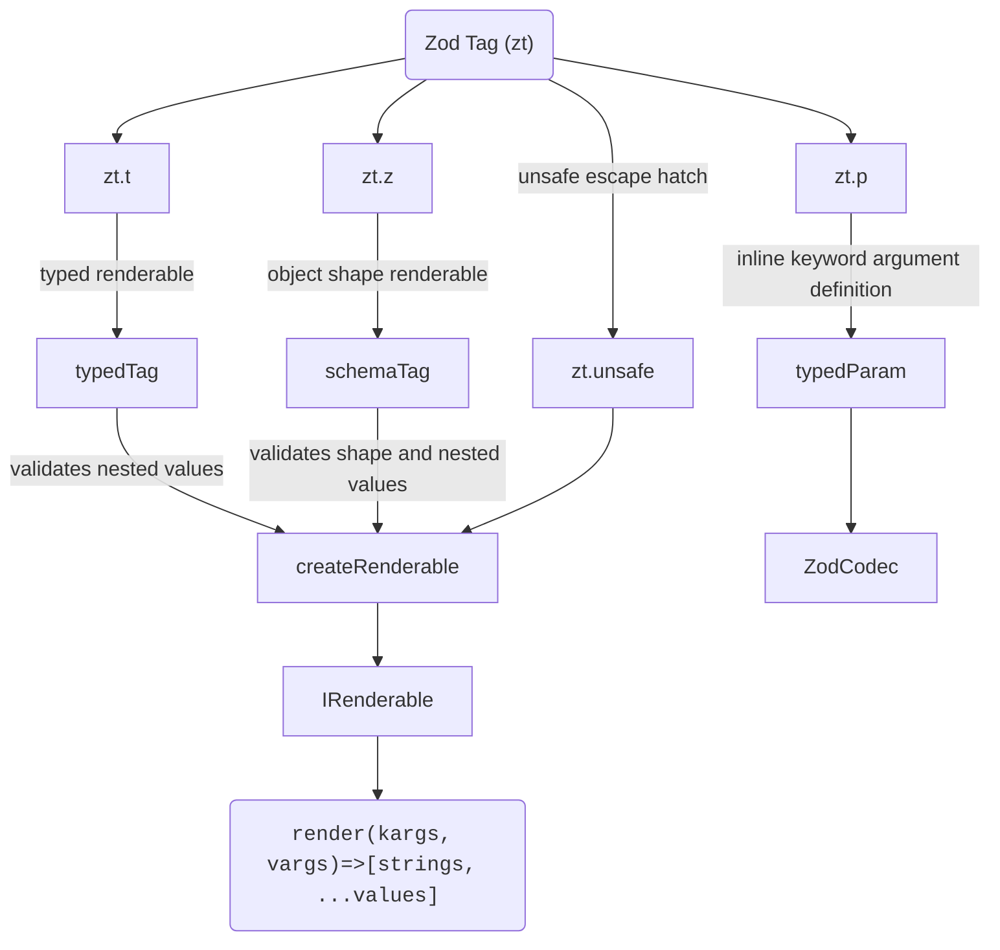

# Zod Tag

## ⚠️ This library is experimental. APIs may change without notice. Use at your own risk!

This is a experimental library that aims to provide templating composition and type/runtime safe interpolation for tagged template literals by leveraging Zod's validation ecosystem.

At compile-time this library tries to infer the template types for a better DX.

At runtime this library validates your templates inputs against the zod schemas definitions and merges nested templates into a single interpolation.

The core functionality consists in three habilities:
- Enable composition by nesting other renderables
- Automatically infer the type of variables your template expects
- Validate those variables against the zod schemas

> My objective was to implement a api design that came to my mind and experiment with it, dont use this, or do it at your own joy and risk.

## Getting started

### Install

```sh
npm install zod-tag
```

### Usage
```ts
import { z } from 'zod'
import { zt } from 'zod-tag'

const user = zt.z({
    firstName: z.string(),
    lastName: z.string(),
})`
    Hello user, your full name must be: ${e => `${e.firstName} ${e.lastName}`}
`

user.render({ firstName: 'John', lastName: 'Doe' })
// -> [['\n    Hello user, your full name must be: ', '\n'], 'John Doe']
// Now you can interpolate raw, escape the values or derive this interpolation into other format or delegate it to other tagged template literals

```

## The API

Either use the `zt.t`|`zt.template` tag or the schema shape `zt.z`|`zt.zod` tag to declaratively define you templates, those functions returns a `IRenderable` interface.

The `IRenderable` interface provides a `render()` method that will receive:
- Keyword Arguments (Kargs) in the first parameter as `Record<string, unknown> | void` (void if no kargs exists for a given template)
- Variadic Arguments (Vargs) in the second parameter as `unknown[] | void` (void if no vargs exists for a given template)

When possible `unknown` will be infered from nested templates, zod schemas input/output or primitives interpolated in the tagged template call.

## Example usage:

### Static templates

Interpolate your template with primitive values or no interpolation.

```ts
    const greeting = zt.t`Hello`
    // -> IRenderable<void, [], []>

    const rendered = greeting.render();
    // -> [['Hello']]

    const [strings, ...values] = rendered;
    // strings -> ['Hello']
    // values -> []
    
    const greeting2 = zt.t`Hello ${123}!`.render();
    // strings -> ['Hello ', '!]
    // values -> [123]
```


### Variadic arguments (inline non object input schemas)

Interpolate your template with primitive zod schemas, those values will account as required variadic argument.

> Note variadic arguments are consumed as they are found inside the template while rendering.
> optional() or default() would still account as required positional argument unless they are found in the end of the vargs list.

```ts

// Variadic arguments are set by inline zod schemas
const greeting = zt.t`Hello, ${z.string()}!`
const greeting2 = zt.t`Hello, ${z.string().default('Does work if no required varg is found afterwards, otherwise its still a required varg even with .default().')}!`

// greeting.render() -> type error and runtime zod validation error

const rendered = greeting.render(
    // no keyword arguments
    void 0,
    // variadic arguments
    ['John']
)
// interpolation [strs, ...vals] -> [['Hello, ', '!'], 'John']
const [strings, ...values] = rendered;

// Some utilities:

zt.debug(rendered)
// unsafe raw -> "Hello, John!"

zt.raw((val, i) => `(${i}=[${value}])`)(rendered)
// custom transform raw -> 'Hello, (0=[John])!'

zt.$n(rendered)
// transformed template -> "Hello, $0!"

```

### Keyword arguments (object shape with zt.z)

Define a shape before you template and interpolate the content with selector functions that manipulates output values from the schema shape.

```ts
const greeting = zt.z({
    first: z.string(),
    last: z.string(),
})`Hello, ${e => `${e.first} ${e.last}`}!`


// greeting.render() -> type error and runtime zod validation error

const rendered = greeting.render({
    first: 'John',
    last: 'Doe'
})
// interpolation [strs, ...vals] -> [['Hello, ', '!'], 'John Doe']
```

### Keyword arguments (inline with zt.p [or other zod shape])

Use `zt.param` or `zt.p` to inline named parameters definitions

```ts
const greeting = zt.t`Hello, ${zt.p('name', z.string())}!`

const rendered = greeting.render({ name: 'John Doe' })
// -> [['Hello, ', '!'], 'John Doe']

```

Or mix `zt.zod` with `zt.param` and variadic arguments:

> Note that variadic arguments inside a conditionally rendered nested template may cause problems, we can mix them but probably shouldn't.

```ts
const greeting = zt.z({
    date: z.date().optional().default(() => new Date())
})`
    The user ${zt.p('user', z.string())} joined today, ${v => v.date.toLocaleDateString()}}!

    Some variadic message: ${z.string()}
`

greeting.render({
    user: 'John Doe',
    date: '01/01/2026', // <- override zod schema w/ .optional()
}, ['Hello new user!']);
// or greetings.render({ user: 'John' }, ['Hello new user!']) given date is optional

```

### Nested templates

Nest your templates and <s>expect</s> hope the merged kargs, vargs type and schema validations to just work.

- Works better with kargs only templating via `zt.z` or `zt.p`

> Due to complex recursive types used to infer the composition kargs and vargs, max depth recursion might be reached, so evicting deeply nested templates will avoid slow compilation or recursion limits errors.

```ts
const userHeading = zt.z({ first: z.string(), last: z.string() })`
    First name: ${e => e.first}
    Last name: ${e => e.last}
`

const userFooter = zt.z({ role: z.enum(['Front-End', 'Back-End', 'Full-Stack']) })`
    User role: ${e => e.role}
`

const userCard = zt.t`
    Today: ${new Date().toLocaleDateString()}

    ---- Heading ----
    ${userHeading}

    ---- Footer ----
    ${userFooter}
`

userCard.render({
    first: 'John',
    last: 'Doe',
    role: 'Full-Stack',
})

```

### Escape hatch (zt.unsafe)

Sometimes we may need to be unsafe just for the sake of sanity (or insanity)

```ts
const tableName = 'i_promise_this_is_not_user_input';
const greeting = zt.t`SELECT * FROM ${zt.unsafe(tableName)}`
greeting.render(); // -> [['SELECT * FROM i_promise_this_is_not_user_input]]
```

## Template values

Values inside the template (`TagValue`) are expected to be one of the following types:

- **Renderable**

Templates can be used as interpolation values, in this case they will be interpolated together and the result is merged in the rendering of the parent template

- **Zod schemas**

- Object input schemas:

If a zod schema value is expected to receive an object as input the karg shape will be merged in the type definitions and when rendering the template the full karg object will be parsed and the schema output will be used as the actual interpolation value if its primitive, otherwise the output will be processed again.

*If its a strict schema and the template has other named arguments this is probably a point of failure.*

> Note the `zt.param`|`zt.p` utility is only a zod codec with an object schema with a single key, an output schema defined in the second parameter and an optional transform fn to determine

- Other input type schemas:

For other zod schemas the value is accounted as a variadic argument to be consumed as the schema is found when rendering. The value found in the vargs array at the same index will be parsed and the schema output will be used as the actual interpolation value if its primitive, otherwise the output will be processed again.

- **Selector functions** (`(arg: Karg) => TagValue<Karg>`)

A function that receives a single argument with the validated keyword args and returns a primitive or another template value that should be processed again

> The whole karg object is received as argument in the selector fn, but only the values in the shape defined with the `zt.zod`|`zt.z` tag are already validated and only these are infered by the type system. Kargs defined inline by `zt.p` or inline object input shapes will be validated only as the interpolation reach the schema value.

- **Primitives** (or anything else) (`string | number | boolean | null`)

Primitive values are left as is, the intention is that after the .render() of a template all values are collapsed into primitives

## Main functions



### (zt.template | zt.t)`` - tagged template

Used to declare typed templates without a base shape for keyword argument validation

Returns a typed `IRenderable` interface

### (zt.zod | zt.z)`` - tagged template

Used to declare typed templates with a base shape for keyword argument validation

Returns a typed `IRenderable` interface

### (zt.param | zt.p)(name, ZodType, transformFn)

Used to declare named parameter (keyword argument) inline/embedded into the template

Returns a `ZodCodec` schema

### zt.unsafe(str: string)

Used as a escape hatch for dynamic values that should be treated as safe and thus statically concatenated.

Returns a void typed `IRenderable` interface with a single static string trusted as safe non user input

## Utility functions

Dont use these as they blindly trust every value calling `String.raw`

### zt.raw

Receives a `mapFn` to map each value, then returns a new function that:

Given a interpolation tuple this will return you the raw string, interpolating everything as raw with `String.raw({ raw: strings }, ...values.map(mapFn))`

### zt.debug

> This is zt.raw(identity)

Given a interpolation tuple this will return you the raw string, interpolating everything as raw with `String.raw({ raw: strings }, ...values)`

### zt.$n

> This is just zt.raw((v, index) => `$${index}`)

Use this to format the interpolation strings with placeholders marked as dolar sign + index.
`$0, $1, ...$n`

### zt.atIndex

> Same as `zt.$n`  with `@` instead of `$` - zt.raw((v, index) => `@${index}`)

Use this to format the interpolation strings with placeholders marked as @ sign + index.
`@0, @1, ...@n`

## SQL Safety: Values vs. Structure

`zod-tag` does not perform any escaping. Like `sql-template-strings` and similar libraries, it produces an interpolation tuple [strings, ...values] that you pass to your database driver. The driver sends values separately over the wire using the parameterized query protocol, preventing injection at the protocol level, not the string level.

The library enforces a clear boundary:

Values (z.string(), zt.p('id', z.uuid()), primitives) -> go into the values array, always parameterized, always safe.

Structure (zt.unsafe('column_name'), zt.unsafe('ASC')) -> concatenated directly into the query string. Only use with hardcoded strings or Zod-validated input (e.g., z.enum(['id', 'name'])).

```ts
// Safe: values are parameterized
const query = zt.t`SELECT * FROM users WHERE id = ${z.uuid()}`
query.render({}, ['a1b2c3d4-...'])
// → [['SELECT * FROM users WHERE id = '], 'a1b2c3d4-...']

// Safe: validated identifiers via zt.unsafe
const column = z.enum(['id', 'name', 'created_at']).parse(userInput)
const ordered = zt.t`SELECT * FROM users ORDER BY ${zt.unsafe(column)}`

// Unsafe!!! raw concatenation
zt.debug(result)  // bypasses parameterization entirely
```

Rule of thumb: 
> use zt.$n (PostgreSQL) or .join('?') (MySQL) to produce placeholders, keep the values array separate, and validate anything that touches zt.unsafe.


## Gotchas to be aware of (AI gen)

While zod-tag is a fun experiment, its design pushes TypeScript’s type system and runtime validation to their limits. Be aware of these sharp edges before using it in anything serious.

### TypeScript Performance & Inference Limits
- Deeply nested templates can cause the TypeScript compiler to slow down or fail with Type instantiation is excessively deep errors. The recursive utility types (MergeKargs, TupleFlatten, etc.) were not built for complex, real‑world component trees.

- Mixing many keyword and variadic arguments in a single template may result in the inferred render() signature degrading to any or unknown. When in doubt, keep templates small and focused.

### Variadic Argument Ordering
- Variadic arguments (z.string(), z.number()) are consumed in the order they appear during template interpolation. If you nest a template that itself expects variadic arguments, it will shift the position of subsequent variadic arguments in the parent template.

- Rule of thumb: Avoid mixing named (zt.p) and variadic arguments in the same template unless you fully control the nesting and can guarantee the order. Prefer keyword arguments for composable components.

### Schema Shape Validation is Loose by Default
- zt.z({ ... }) creates a schema using z.object(shape).loose(). This means extra properties are allowed in the keyword arguments object without throwing a validation error.

- This design choice enables easier composition of nested templates but may hide typos or unexpected input.

### Raw Utilities Bypass All Safety
- zt.debug, zt.$n, and zt.raw blindly concatenate values into a string. They do not escape content for SQL, HTML, or any other context. These functions exist only for debugging or introspection. Never use their output in production queries, HTML responses, or shell commands.

### expectsObject Edge Cases
- The internal expectsObject helper makes a best‑effort guess at whether a Zod schema expects an object argument. It handles unions, intersections, and pipes, but complex schemas (e.g., deeply nested ZodEffects, custom refinements) may be misidentified.

- If a schema that should receive the full keyword argument object is mistakenly treated as a variadic schema, runtime errors will occur. Test any non‑trivial schemas thoroughly.

### No Caching or Pre‑compilation
- Every call to .render() re‑evaluates the entire interpolation logic, including re‑decoding all Zod schemas and re‑executing selector functions. This is fine for occasional use but not suitable for high‑throughput scenarios (e.g., server‑side rendering on every request).

### The API is Not Frozen
- This is an experimental library. Method names, type signatures, and internal behavior may change without notice. Do not depend on it for production systems unless you vendor the code and pin the exact version.