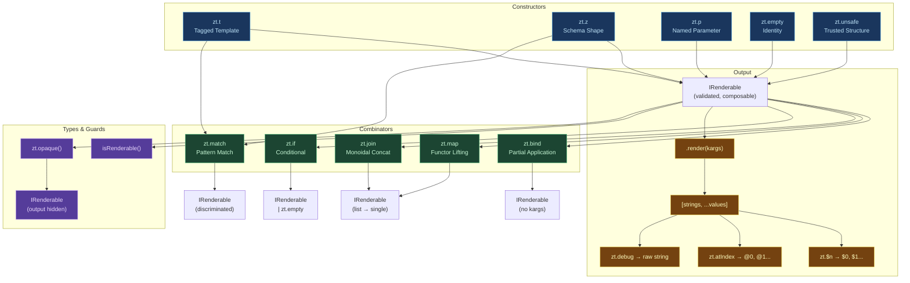
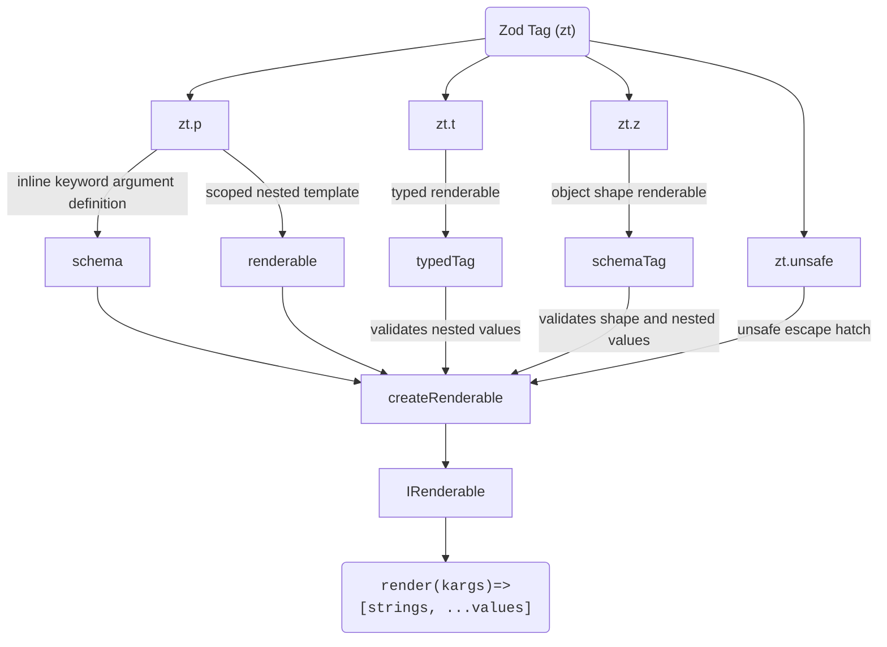

# Zod Tag

## ⚠️ This library is experimental. APIs may change without notice. Use at your own risk!

> The fact is that I've put a loop inside another as they tell us not to do and the resulting is becoming surprisingly fun to experiment with! (Also they were right... I didn't needed the nested one :]). Ok i'm looping my head here!

This is a experimental library that aims to provide templating composition and type/runtime safe interpolation for tagged template literals by leveraging Zod's validation ecosystem.

At definition time this library pre-flattens nested renderable structures and tries to infer the template types for a better DX.

At runtime this library validates your templates inputs against the zod schemas definitions and merges nested templates into a single interpolation.

The core functionality consists in three abilities:
- Enable composition by nesting other renderables
- Automatically infer the type of variables your template expects
- Validate those variables against the zod schemas

> My objective was to implement a api design that came to my mind and experiment with it, dont use this, or do it at your own joy and risk.

# Meet Zod Tag!

**Typed, validated, composable interpolation trees for TypeScript.**

How do you write multi-purpose prompts, database queries, GraphQL mutations and complex templated structures that are simultaneously composable, type-safe AND give you explicit control over what gets parameterized?

**Zod Tag** provides a seriously good pattern for a real problem: safe template parameterization. By letting selector functions encode architectural decisions in a natural templating flow that clearly distinguishes what is protocol structure from parameterized value right on your code.

## What Problem Does This Solve?

When you generate code from templates (SQL queries, GraphQL, LLM prompts, [or concatenate strings]) you constantly face a decision:

- **Structure**: what's part of the query/prompt itself?
- **Values**: what's user input that should be parameterized?

Most tools force you into one extreme:

| Approach | Structure control | Injection safety |
|----------|-------------------|------------------|
| String concatenation | Full control | ❌ None |
| Simple tagged templates | ❌ Everything's a value | ✅ Full |
| ORMs / query builders | Hidden behind API | ✅ Full |

**zod-tag** gives you both: explicit, visible control over what's structure and what's a value, with types enforcing the distinction.

The library separates concerns at the point of use:

- Renderables in selectors = template structure (protocol, language specific, syntax keywords, hardcoded/trusted data)
- Schemas or primitives in selectors = parameterized values (user input, IDs, dates, other values)

**Example: Conditional SQL Structure**

```ts
const createUserAndProfile = zt.z({
  userId: z.uuid(),
  bio: z.string().optional(),
})`
  INSERT INTO users (id) VALUES (${e => e.userId});

  ${e => e.bio
    ? zt.t`INSERT INTO profiles (user_id, bio) VALUES (${e => e.userId}, ${e => e.bio})`
    : zt.t``
  }
`
createUserAndProfile.render({ userId: crypto.randomUUID(), bio: 'user profile bio' })
// bio provided:
// → INSERT INTO users (id) VALUES ($1);
//   INSERT INTO profiles (user_id, bio) VALUES ($2, $3)
// args: [userId, userId, bio]

createUserAndProfile.render({ userId: crypto.randomUUID() })
// bio omitted:
// → INSERT INTO users (id) VALUES ($1);
// args: [userId]
```

The selector for bio doesn't return the bio text, it returns an entire INSERT or an empty template. The bio itself stays a runtime validated parameterized value. The conditional structure is visible, auditable, and type-checked.

Zod Tag actually returns a interpolation tuple with `[strings: string[], ...values: unknown[]]`, this means it's agnostic in terms of database, client, syntax or anything, the only dependency is Zod v4.

## Quick Slop (Examples)

### SQL Query Builder
[Slop Test - repository pattern from repo.slop-test.ts](./src/__tests__/slop/repo.slop-test.ts)

```ts
class UserRepository extends Repository {
    constructor() {
        super('users');
    }

    // Create a new user
    create = this.sql({
        id: z.uuid().optional().default(() => crypto.randomUUID()),
        name: z.string().min(1).max(255),
        email: z.email(),
        role: z.enum(['admin', 'user', 'guest']).default('user'),
    })`
    INSERT INTO ${this.table} 
      (id, name, email, role)
    VALUES (
      ${e => e.id},
      ${e => e.name}, 
      ${e => e.email}, 
      ${e => e.role}
    )
    RETURNING *
  `;

    // Find user by ID
    findById = this.sql({
        id: z.uuid(),
    })`
    SELECT * FROM ${this.table}
    WHERE id = ${e => e.id}
  `;
}
```

### LLM Prompt Composition

[Slop Test - persona/format/severity block composition from prompt-2.slop-test.ts](./src/__tests__/slop/prompt-2.slop-test.ts)


### Pattern-Matched Function Dispatch

[Slop Test - math calculator from pattern-matching-function-definitions.slop-test.ts](./src/__tests__/slop/pattern-matching-function-definitions.slop-test.ts)

```ts

// ============================================================================
// 1. PURE MATH — stateless, every branch returns a single number value
// ============================================================================

const math = zt.match('fn', {
    add: zt.z({ a: z.number(), b: z.number() })`${e => e.a + e.b}`,
    sub: zt.z({ a: z.number(), b: z.number() })`${e => e.a - e.b}`,
    mul: zt.z({ a: z.number(), b: z.number() })`${e => e.a * e.b}`,
    div: zt.z({ a: z.number(), b: z.number().min(Number.EPSILON) })`${e => e.a / e.b}`,
    pow: zt.z({ base: z.number(), exp: z.number().int() })`${e => Math.pow(e.base, e.exp)}`,
    clamp: zt.z({ val: z.number(), min: z.number(), max: z.number() })`${e => Math.max(e.min, Math.min(e.max, e.val))}`,
    neg: zt.z({ x: z.number() })`${e => -e.x}`,
    abs: zt.z({ x: z.number() })`${e => Math.abs(e.x)}`,
    sqrt: zt.z({ x: z.number().min(0) })`${e => Math.sqrt(e.x)}`,
})

type MathFn = IRenderableKargs<typeof math>

```

### NPC Dialog State Machine

[Slop Test - npc dialog state machine npc-dialog-state-machine.slop-test](./src/__tests__/slop/npc-dialog-state-machine.slop-test.ts)


## The Core Idea

A `IRenderable<K, V>` is a pure function from validated input to a structural tuple `[strings, ...values]`. Compose them like algebraic operations.

Every `${}` in your template is a hole and receives the validated arguments. **Its return type decides how it's treated:**

| Return type | Treatment | Example |
|-------------|-----------|---------|
| Constant primitive (`string`, `number`, what else) | any constant not processed by zod tag | `123`, `'value'`, `[1, 2, 3]`, `{ a: 1 }` |
| Selector primitive (`string`, `number`, what else) | Keyword/named parameterized value `e` | `${e => e.userId}` |
| `z.codec()`, `z.object().transform()` | Schemas with object input register named parameterized values | `${z.codec(...).transform(e => ...)}` |
| `zt.p('name', z.string())` | Inlined keyword named validated parameterized value | `${zt.p('email', z.email())}` |
| `zt.p('scoped', IRenderable)` | Scoped | `${zt.p('cta', renderableButton)}` |
| `zt.t` / `zt.z()` renderable | Merged into template **structure** | <code>${zt.t\`structure ${'value'}\`}</code> |
| `zt.unsafe(schema, str)` | Trusted template **structure** (be sure to use a well suited validation schema for your use case) | `${e => zt.unsafe(z.enum(['ASC', 'DESC']), e.sortOrder)}` |
| `zt.t`` ` (empty) | Omitted entirely | `${e => e.something ? ... : zt.t``}` |

> The selector function `e => ...` isn't just transforming data - it's classifying what becomes structure and what becomes a parameterized value.

This means you **see the structure/value boundary in your code**. Types enforce that you don't accidentally parameterize keywords or inline user input.

-----

## The functional approach

### Zod Tag call your selectors inside a validated computation context that supports:

| **Operation** | **What It Does** | **The Intuition** |
|-------------|-----------|---------|
| `zt.z(shape)` | Wrap a value in validation context | "I have data, but trust nothing" |
| `zt.t'${e => f(e)}'` | Transform validated data | "Once validated, derive new values" |
| `zt.bind(t, k)` | Close over known values | "I know some answers already" |
| `zt.map(list, t, f)` | Lift a list into validation context | "Validate each item separately" |
| `zt.join(items, sep)` | Concatenate validated outputs | "Combine fragments structurally" |
| `zt.if(cond, t)` | Conditionally include validated output | "Only include this if needed" |
| `zt.match(disc, cases)` | Branch on validated discriminator | "Choose the right validated fragment" |
| `zt.empty` | Empty validated output | "Nothing to validate here" |
| `zt.unsafe(schema, v)` | Trust a value after checking |"I've verified this is safe" |

> Important: `zt.z(shape)`: the shape schema is created with a loose strategy

Each of these is a mathematically well-behaved operation - they compose predictably and follow laws:

- `zt.empty + anything = anything` (identity)
- `(a + b) + c = a + (b + c)` (associativity)
- `zt.map(list, t, id) = zt.map(list, t, id)` (map with identity is identity)
- `zt.bind(t, k).render() = t.render(k)` (bind then render = render with bound kargs)

## API

### Core Constructors
- <code>zt.t`...`</code>: Create a renderable from a tagged template literal
- <code>zt.z({ shape })`...`</code>: Create a renderable with a Zod shape for loose object schema with keyword arguments
- <code>zt.p(name, renderable)`...`</code>: Create a renderable with kargs scoped at key name of parent keyword arguments
- `zt.empty`: The identity renderable (monoidal identity)

### Combinators
- `zt.match(discriminator, cases)`: Pattern-matched dispatch
- `zt.bind(renderable, kargs)`: Partial application
- `zt.map(list, renderable, mapFn, separator?)`: Functorial lift
- `zt.join(list, separator)`: Monoidal concatenation
- `zt.if(condition, renderable)`: Conditional rendering

### Parameters & Constants
- `zt.p(name, schema, transform?)`: Named keyword parameter
- `zt.unsafe(schema, value)`: Validated structural constant

## The Sharper Intuition

When you write:

```ts
const user = zt.z({ name: z.string() })`Hello ${e => e.name}`
const bound = zt.bind(user, { name: 'Alice' })
const mapped = zt.map(['Alice', 'Bob'], user, name => ({ name }), zt.t` - `)
```

You're doing following things:

#### 1. You're wrapping values in a context (`zt.z(shape)`)

**"Functor"** (a context that holds a value):

The context is "this value needs validation"

#### 2. You're applying functions inside that context (`e => e.name`)

**"Map"** (apply a function without leaving the context)

You're transforming the value while keeping the validation requirement

#### 3. You're flattening nested contexts (`zt.bind()`)

**"Monad"** (when a wrapped thing produces another wrapped thing, flatten them)

The expression `zt.bind(user, { name: 'Alice' })` takes a renderable and returns a renderable (not a renderable of a renderable)

#### 4. You're combining independent wrapped values (multiple `${}` holes)

**"Applicative"** (combine wrapped values where the wrappers are independent)

Each `${}` hole in a template is independent, they all get the same kargs but don't depend on each other's outputs

#### 5. You're choosing between wrapped values (`zt.if`, `zt.match`)

**"Sum type"**

Depending on runtime data, you pick one wrapped value or another

#### 6. You have an empty wrapped value (`zt.empty`)

**"Identity element" or "Monoid identity"**

It composes with anything and leaves it unchanged

#### 7. You're concatenating wrapped values (`zt.join`)

- **"Monoid"** (a way to combine two things of the same type with an identity)

The expression `zt.join(items, sep)` combines renderables with a separator

> The rest of this document covers the full API and advanced patterns, but the above illustrates the central design decision: **selectors classify structure vs. values**.

## Getting started

### Install

```sh
npm install zod-tag
```

### Usage
```ts
import { z } from 'zod'
import { zt } from 'zod-tag'

const user = zt.z({
    firstName: z.string(),
    lastName: z.string(),
})`
    Hello user, your full name must be: ${e => `${e.firstName} ${e.lastName}`}
`

user.render({ firstName: 'John', lastName: 'Doe' })
// -> [['\n    Hello user, your full name must be: ', '\n'], 'John Doe']

// Now you can interpolate raw, escape the values, derive this interpolation into other format or delegate it to other tagged template literals

```



## The API

#### `zt` (default export)

The main namespace. All functionality is accessed through `zt`:

```ts
import { zt } from 'zod-tag'
```

#### <code>zt.t`...`</code>

Creates a `IRenderable` from a tagged template literal with no base schema. The type of expected keyword arguments is inferred entirely from interpolated values (inline schemas, `zt.p`, nested renderables).

```ts
// Static — no interpolation values, no kargs
const static = zt.t`Hello World`
static.render() // → [['Hello World']]

// With inline schema — kargs inferred from `zt.p`
const greet = zt.t`Hello, ${zt.p('name', z.string())}!`
greet.render({ name: 'Alice' }) // → [['Hello, ', '!'], 'Alice']
```

`zt` alone is an alias for `zt.t`:

```ts
const same = zt`Hello ${'World'}`
```

#### <code>zt.z(shape)`...`</code>

Creates a `IRenderable` with a Zod object shape that validates all keyword arguments at render time. The shape is passed to `z.object(shape).loose()`, allowing extra properties for nested composition.

```ts
function z<S extends ZodRawShape>(
  shape: S
): TypedTag<input<S>, output<S>>
```

The returned TypedTag is a tagged template function whose kargs type is the intersection of the shape input and any inline schemas/nested renderables.

```ts
const user = zt.z({
  firstName: z.string(),
  lastName: z.string(),
})`Hello, ${e => `${e.firstName} ${e.lastName}`}!`

user.render({ firstName: 'John', lastName: 'Doe' })
// → [['Hello, ', '!'], 'John Doe']
```

#### `zt.p(name, schema, transform?)`

Declares a named keyword argument inline that:
- Wraps the schema in a single-key `z.object({ [name]: schema })`.
- Decodes the parent kargs to extract `kargs[name]`.
- Applies the optional transform function to produce the final interpolation value.

```ts
const tpl = zt.t`Email: ${zt.p('email', z.email(), e => `mailto:${e}`)}`
tpl.render({ email: 'user@test.com' }) // → [['Email: ', ''], 'mailto:user@test.com']
```

#### `zt.p(name, renderable)`

Declares a new `IRenderable` scoped by the name argument

```ts
const button = zt.t`<button>${zt.p('label', z.string())}</button>`
const form = zt.t`Save: ${zt.p('saveBtn', button)} Cancel: ${zt.p('cancelBtn', button)}`
form.render({
  saveBtn: { label: 'Save' },
  cancelBtn: { label: 'Cancel' },
})
```

#### `zt.empty`

The identity `IRenderable`. Represents a semantically empty structural string. Composes with any `IRenderable` and leaves it unchanged.

`Type: IRenderable<void, []>`

```ts
const result = zt.t`before ${zt.empty} after`
result.render() // → [['before  after']]
```

### Combinators

#### `zt.bind(renderable, kargs)`

Applies the keyword arguments to a `IRenderable` returning a new collapsed one.

Returns a new `IRenderable` that requires no kargs — the provided kargs are validated at bind time and baked in.

Validates at bind time.

```ts
const greet = zt.z({ name: z.string() })`Hello, ${e => e.name}!`
const greetAlice = zt.bind(greet, { name: 'Alice' })
greetAlice.render() // → [['Hello, ', '!'], 'Alice']
```

#### `zt.map(list, renderable, mapFn, separator?)`

Lifts an array of raw data into a single composed `IRenderable`. Each element is transformed via `mapFn` into the kargs expected by renderable, bound to it, and joined with the optional separator.

```ts
const itemTpl = zt.z({ name: z.string(), price: z.number() })`${e => e.name}: $${e => e.price}`
const items = [
  { product: 'Sword', cost: 50 },
  { product: 'Shield', cost: 75 },
]
const list = zt.map(items, itemTpl, item => ({ name: item.product, price: item.cost }), zt.t`, `)
list.render() // → [['', ': $', ', ', ': $', ''], 'Sword', 50, 'Shield', 75]
```

#### `zt.join(list, separator)`

Joins an array of parameterized values with a structural separator. The functional equivalent of the `reduce` pattern for building lists of values with structural separators.

```ts
const tpl = zt.z({ ids: z.array(z.string()) })`WHERE id IN (${e => zt.join(e.ids, zt.t`, `)})`
tpl.render({ ids: ['a', 'b', 'c'] })
// → [['WHERE id IN (', ', ', ', ', ')'], 'a', 'b', 'c']
```

#### `zt.if(condition, renderable)`

Conditionally renders a template. Returns the renderable if the condition is truthy, otherwise returns `zt.empty`.

Uses JavaScript truthiness, making 0 and '' falsy.


```ts
const tpl = zt.z({ name: z.string().optional() })`
  ${e => zt.if(e.name, zt.t`Your name is ${e.name}`)}
`
tpl.render({})          // → [['\n  \n'], ...]
tpl.render({ name: 'A' }) // → [['\n  Your name is ', '\n'], 'A']
```

#### `zt.match(discriminator, cases)`

Pattern-matching / discriminated union dispatch. Each case is a `IRenderable` whose shape is extracted, wrapped with a `z.literal()` discriminator, and combined into a `z.discriminatedUnion`. At render time, the union validates and routes to the correct branch.

```ts
const math = zt.match('op', {
  add: zt.z({ a: z.number(), b: z.number() })`${e => e.a + e.b}`,
  sub: zt.z({ a: z.number(), b: z.number() })`${e => e.a - e.b}`,
  neg: zt.z({ x: z.number() })`${e => -e.x}`,
})

math.render({ op: 'add', a: 10, b: 32 }) // → [['', ''], 42]
math.render({ op: 'neg', x: 5 })          // → [['', ''], -5]
// math.render({ op: 'mul' }) — rejected: 'mul' is not a valid discriminator
```

### Escape Hatches

#### `zt.unsafe(schema, value)

Treats a validated value as trusted structure. The value is validated against schema at definition time, then stringified and concatenated directly into the template strings. It never appears in the values array.

Use for identifiers, keywords, or other protocol-level strings that MUST be validated before structural use (column names, sort directions, enum-constrained identifiers).

`zt.unsafe` injects data into structure, never as values.

```ts
const table = 'users' // trusted, not user input
const query = zt.t`SELECT * FROM ${zt.unsafe(z.string().regex(/^\w+$/), table)}`
query.render() // → [['SELECT * FROM users']]

// With validated user-facing enum
const column = z.enum(['id', 'name', 'created_at'])
const tpl = zt.z({ sortCol: column, dir: z.enum(['ASC', 'DESC']) })`
  ORDER BY ${e => zt.unsafe(column, e.sortCol)} ${e => zt.unsafe(z.enum(['ASC', 'DESC']), e.dir)}
`
```

⚠️ Warning: `zt.unsafe` concatenates directly into the structure strings. Only use with Zod-validated inputs or hardcoded literals. Never pass raw user input.

#### `zt.opaque(renderable)`

Opts a `IRenderable` out of output tuple type inference. The output is typed as [] (empty), reducing TypeScript compiler pressure for deeply nested kargs or complex compositions of output tuples.

```ts
const complex = zt.z({ ... })`... deeply nested with many conditions w/ different sets of values may slow down ts compiler ...`
// If a large template being inserted into a parent one trigger compiler error at parent:
const safe = zt.opaque(complex)
// safe.render(kargs) → IRenderable<..., []> (output tuple hidden from type system)
```

### Format Utilities

These utilities transform a rendered interpolation tuple `[string[], ...values[]]` into a formatted string. They operate on the already-rendered tuple and do not affect the `IRenderable` itself.

#### `zt.raw(mapFn)([strings, ...values])`

Creates a custom formatter by applying `mapFn` to each value before calling `String.raw`. Returns a function that accepts a rendered tuple.

```ts
const rendered = zt.z({ x: z.number() })`Value: ${e => e.x}`.render({ x: 42 })
const custom = zt.raw((v, i) => `<${i}>${v}</${i}>`)
custom(rendered) // → 'Value: <0>42</0>'
```

#### `zt.$n([strings, ...values])`

Formats the interpolation with PostgreSQL-style numbered placeholders ($0, $1, ... $n).

Type: `([string[], ...unknown[]]) => string`

```ts
const tpl = zt.z({ a: z.string(), b: z.number() })`${e => e.a} = ${e => e.b}`
zt.$n(tpl.render({ a: 'x', b: 1 })) // → '$0 = $1'
```

#### `zt.atIndex([strings, ...values])`

Formats the interpolation with @n placeholders (@0, @1, ... @n).

Type: `([string[], ...unknown[]]) => string`

```ts
zt.atIndex(tpl.render({ a: 'x', b: 1 })) // → '@0 = @1'
```

#### `zt.debug([strings, ...values])`

Concatenates the interpolation as a raw string for debugging. Equivalent to `zt.raw(v => v)`. Never use in production queries, HTML, or shell commands — this bypasses all parameterization.

Type: `([string[], ...unknown[]]) => string`

```ts
zt.debug(tpl.render({ a: 'x', b: 1 })) // → 'x = 1'
```
#### `isRenderable(v)`

Type guard. Returns true if v is an IRenderable instance.

```ts
if(isRenderable(v)) v.render()
```

### Types

#### `IRenderable<Kargs, Output>`

The core interface. A `IRenderable` is an object with a render method and a `RENDERABLE_SYMBOL` brand.

#### `IRenderableKargs<T>`

Extracts the keyword arguments type from a Renderable:

#### `IRenderableOutput<T>`

Extracts the output values tuple type from a Renderable:

#### `ExtractKargs<T>`

Recursively extracts the merged keyword arguments type from a tuple of tagged template interpolation values.

#### `ExtractOutput<T>`

Recursively extracts the merged output values tuple type from a tuple of tagged template interpolation values.

### Error Handling

#### `InterpolationError`

Thrown when validation fails at any level of the interpolation tree. The error includes:
**Operation type**: `'root-schema'` | `'karg-schema'` | `'renderable'` | `'selector'`
**Index**: which interpolation hole caused the error
**Preview**: a truncated view of the template around the error site
**Trace**: the chain of nested template calls leading to the error

```ts
try {
  myTemplate.render(invalidKargs)
} catch (e) {
  if (e instanceof InterpolationError) {
    console.log(e.message) // Formatted error with preview and trace
    console.log(e.error)   // The original Zod error
  }
}
```


## More on the API and the usage

Either use the `zt.t` (zod tag template) tag or the schema shape `zt.z` (zod tag shape) tag to declaratively define you templates, those functions returns a `IRenderable` interface.

The `IRenderable` interface provides a `render(kargs)` method that will receive the keyword arguments (Kargs) in the first parameter as `Record<string, unknown> | void` (void if no kargs exists for a given template)

When possible `unknown` will be infered from nested templates, zod schemas input/output or primitives interpolated in the tagged template call.

## Example usage:

### Static and constants templates

Interpolate your template with primitive values or no interpolation.

```ts
    const greeting = zt.t`Hello`
    // -> IRenderable<void, []>

    const rendered = greeting.render();
    // -> [['Hello']]

    const [strings, ...values] = rendered;
    // strings -> ['Hello']
    // values -> []
    
    const greeting2 = zt.t`Hello ${123}!`.render();
    // strings -> ['Hello ', '!]
    // values -> [123]
```

### Keyword arguments (object shape with zt.z)

Define a shape before you template and interpolate the content with selector functions that manipulates output values from the schema shape.

```ts
const greeting = zt.z({
    first: z.string(),
    last: z.string(),
})`Hello, ${e => `${e.first} ${e.last}`}!`


// greeting.render() -> type error and runtime zod validation error

const rendered = greeting.render({
    first: 'John',
    last: 'Doe'
})
// interpolation [strs, ...vals] -> [['Hello, ', '!'], 'John Doe']
```

### Keyword arguments (inline with zt.p [or other zod shape])

Use `zt.p` to inline named parameters definitions, zod types with object inputs and other renderables also account.

```ts
const greeting = zt.t`Hello, ${zt.p('name', z.string())}!`

const rendered = greeting.render({ name: 'John Doe' })
// -> [['Hello, ', '!'], 'John Doe']

const template = zt.t`
    Template heading
    ${zt.p('greeting', greeting)}
`
template.render({ greeting: { name: 'John Doe' }})
// -> [['Template heading\n    Hello, ', '!'], 'John Doe']

```

Or mix `zt.z` with `zt.p`:

```ts
const greeting = zt.z({
    date: z.date().optional().default(() => new Date())
})`
    The user ${zt.p('user', z.string())} joined today, ${v => v.date.toLocaleDateString()}}!

`

greeting.render({
    user: 'John Doe',
    date: '01/01/2026', // <- override zod schema w/ .optional()
});
// or greetings.render({ user: 'John' }) given date is optional

```

### Nested templates

Nest your templates and <s>expect</s> hope the merged kargs, output values and schema validations to just work.

- Works both with namespaced kargs with `zt.p` or parent scope via `zt.z`

> Due to complex recursive types used to infer the composition kargs, max depth recursion might be reached, so evicting deeply nested templates will avoid slow compilation or recursion limits errors. use zt.opaque(renderable) to complex templates to optout of [...values: Output]  tuple inference.

```ts
const userHeading = zt.z({ first: z.string(), last: z.string() })`
    First name: ${e => e.first}
    Last name: ${e => e.last}
`

const userFooter = zt.z({ role: z.enum(['Front-End', 'Back-End', 'Full-Stack']) })`
    User role: ${e => e.role}
`

const userCard = zt.t`
    Today: ${new Date().toLocaleDateString()}

    ---- Heading ----
    ${userHeading}

    ---- Footer ----
    ${userFooter}
`

userCard.render({
    first: 'John',
    last: 'Doe',
    role: 'Full-Stack',
})

```

### Scoped composition with `zt.p`

When the second argument to `zt.p` is a Zod schema, it creates a validated named parameter.

When it's a renderable, it creates a scoped wrapper, the parent passes { scopeName: { ...childKargs } } and `zt.p` extracts the nested object before calling the child's .render(). This works recursively, so deeply nested fragments compose cleanly.

```ts
const button = zt.t`<button>${zt.p('label', z.string())}</button>`
const addressBlock = zt.z({
  street: z.string(),
  city: z.string(),
})`${e => e.street}, ${e => e.city}`

const form = zt.z({ title: z.string() })`
  <h1>${e => e.title}</h1>
  ${zt.p('saveBtn', button)}
  ${zt.p('cancelBtn', button)}
  Shipping: ${zt.p('shipping', addressBlock)}
  Billing: ${zt.p('billing', addressBlock)}
`

form.render({
  title: 'Checkout',
  saveBtn: { label: 'Place Order' },
  cancelBtn: { label: 'Go Back' },
  shipping: { street: '123 Main', city: 'NYC' },
  billing: { street: '456 Oak', city: 'NYC' },
})
```

### Escape hatch (zt.unsafe)

Sometimes we may need to be unsafe just for the sake of sanity (or insanity)

The output of the schema passed as first argument is expected to return a primitive value to be casted into string

```ts
const tableName = 'i_promise_this_is_not_user_input';
const greeting = zt.t`SELECT * FROM ${zt.unsafe(z.string().regex(/^\w+$/), tableName)}`
greeting.render(); // -> [['SELECT * FROM i_promise_this_is_not_user_input']]
```

## Template values

Values inside the template (`TagValue`) are expected to be one of the following types:

- **IRenderable**

Templates can be used as interpolation values, in this case they will be interpolated together and the result is merged in the rendering of the parent template

- **Zod schemas**

- Object input schemas:

If a zod schema value is expected to receive an object as input the karg shape will be merged in the type definitions and when rendering the template the full karg object will be parsed and the schema output will be used as the actual interpolation value if its primitive, otherwise the output will be processed again.

*If its a strict schema and the template has other named arguments this is probably a point of failure.*

> Note that for zod schemas the `zt.p` utility is only a an object schema with a single key, an output schema defined in the second parameter and an optional transform fn to determine its output, for nested templates it just scope the parents kargs schema with a namespace key.

- **Selector functions** (`(arg: Karg) => TagValue<Karg>`)

A function that receives a single argument with the validated keyword args and returns a primitive or another template value that should be processed again

> The whole karg object is received as argument in the selector fn, but only the values in the shape defined with the `zt.z` tag are already validated and only these are infered by the type system. Kargs defined inline by `zt.p` or inline object input shapes will be validated only as the interpolation reach the schema value.

- **Primitives** (or anything else) (`string | number | boolean | null | any[] | Record, Date, etc`)

Primitive values are left as is, the intention is that after the .render() of a template all values are collapsed into primitives

## Main functions



### zt.t`` - tagged template

Used to declare typed templates without a base shape for keyword argument validation

Returns a typed `IRenderable` interface

> Note the `zt` namespace is `zt.t` so <code>zt\`content\`</code> is interchangeable with <code>zt.t\`content\`</code>

### zt.z(shape: ZodRawShape)`` - tagged template

Used to declare typed templates with a base shape for keyword argument validation

Returns a typed `IRenderable` interface

### zt.p

Use to declare a scoped parameter or scoped nested renderable

#### zt.p(name: string, schema: ZodType, transformFn: TagSelector)

Used to declare named parameter (keyword argument) inline/embedded into the template

Returns an `IRenderable` that wraps the schema in a single-key object and applies the optional transform.

#### zt.p(name: string, template: IRenderable)

Used to declare a scoped nested rendered inline/embedded into the template kargs requirements under the `name` argument key.

Returns a `IRenderable`

### zt.unsafe(schema: ZodType, str: string)

Used as a escape hatch for dynamic values that should be treated as safe and thus statically concatenated.

Returns a void typed `IRenderable` interface with a single static string trusted as safe non user input

Schema is enforced by the first argument but it's left to userspace to decide what to check. 

## Utility functions

### Template utilities

### zt.if(condition: any, template: IRenderable)

Conditional rendering utility, no much better then <code>${e => e.something ? template : zt\`\`}</code>

```ts

const tpl = zt.z({ name: z.string().optional() })`
    ${e => zt.if(e.name, zt.t`Your name is ${e.name}`)}
`
// same as ${e => e.name ? zt.t`Your name is ${e.name}`) : zt.t`` }
```

### zt.join(list: unknown[], separator: IRenderable<void, []>)

The `zt.join` utility provides a seamless way to apply the `e => e.listData.reduce()` pattern.

Use it when you have a list of parameterized values that should be joined together with a structural separator.

It returns another `IRenderable` that joins together every item on that list with the structural content of the separator template on the second argument.

```ts
// The reducer pattern arises when you need to compose a parameterized value list with some structure in the between, e.g,:
const template1 = zt.z({
    ids: z.array(z.string())
})`before - ${e => e.ids.reduce((acc, id) => {
    /**
     * Types get ugly here - as any, null!, etc - but there are some facts in the ternary below:
     * - each id is a parameterized value
     * - if there is only one id we want it to behave the same as a ${id} 'hole' in the template interpolation
     * - but if there is more than one we want structural data between them as separator without treating the id as structure
     * We avoid zt.unsafe by using the params.reduce() pattern
     */
    return acc ? zt.t`${acc}, ${id}` : zt.t`${id}`;
}, null)} - after`;

// the usage of zt.join does exactly the above with shorter syntax:
const template2 = zt.z({
    ids: z.array(z.string())
})`before - ${e => zt.join(e.ids, zt.t`, `)} - after`

const result1 = template1.render({ ids: ['1', '2', '3']})
// -> [['before - ', ' - structure - ', ' - structure - ', ' - after'], '1', '2', '3']
const result2 = template2.render({ ids: ['1', '2', '3']})
// -> [['before - ', ' - structure - ', ' - structure - ', ' - after'], '1', '2', '3']
```

### Unsafe utilities

Dont use these as they blindly trust every value calling `String.raw`

### zt.raw

Receives a `mapFn` to map each value, then returns a new function that:

Given a interpolation tuple this will return you the raw string, interpolating everything as raw with `String.raw({ raw: strings }, ...values.map(mapFn))`

### zt.debug

> This is zt.raw(identity)

Given a interpolation tuple this will return you the raw string, interpolating everything as raw with `String.raw({ raw: strings }, ...values)`

### zt.$n

> This is just zt.raw((v, index) => `$${index}`)

Use this to format the interpolation strings with placeholders marked as dolar sign + index.
`$0, $1, ...$n`

### zt.atIndex

> Same as `zt.$n`  with `@` instead of `$` - zt.raw((v, index) => `@${index}`)

Use this to format the interpolation strings with placeholders marked as @ sign + index.
`@0, @1, ...@n`

## SQL Safety: Values vs. Structure

`zod-tag` does not perform any escaping. Like `sql-template-strings` and similar libraries, it produces an interpolation tuple [strings, ...values] that you pass to your database driver. The driver sends values separately over the wire using the parameterized query protocol, preventing injection at the protocol level, not the string level.

The library enforces a clear boundary:

Values (() => 'value', zt.p('id', z.uuid()), primitives) -> go into the values array, always parameterized, always safe.

Structure (zt.unsafe(z.enum(['id', 'column_name']), 'column_name'), zt.unsafe(z.enum(['ASC', 'DESC']),'ASC')) -> concatenated directly into the query string. Only use with hardcoded strings or Zod-validated input (e.g., z.enum(['id', 'name'])).

```ts
// Safe: values are parameterized
const query = zt.t`SELECT * FROM users WHERE id = ${zt.p('id', z.uuid())}`
query.render({ id: 'a1b2c3d4-...' })
// → [['SELECT * FROM users WHERE id = '], 'a1b2c3d4-...']

// Safe: validated identifiers via zt.unsafe
const column = z.enum(['id', 'name', 'created_at'])
const ordered = zt.t`SELECT * FROM users ORDER BY ${zt.unsafe(column, userInput)}`

// Unsafe!!! raw concatenation
zt.debug(result)  // bypasses parameterization entirely
```

Rule of thumb: 
> use zt.$n (PostgreSQL) or .join('?') (MySQL) to produce placeholders, keep the values array separate, and validate anything that touches zt.unsafe.


## Gotchas to be aware of (AI gen)

While zod-tag is a fun experiment, its design pushes TypeScript’s type system and runtime validation to their limits. Be aware of these sharp edges before using it in anything serious.

### TypeScript Performance & Inference Limits
Wide output‑tuple unions can slow IntelliSense or produce unreadable hover types. This happens when you reuse a renderable that has a large output type many times in the same template (e.g., an environment block with dozens of values, repeated for every environment). TypeScript must then compute the concatenation of all those tuples, which can explode combinatorially.

Use `zt.opaque(renderable)` to bail out of output‑tuple inference for such heavy blocks. It preserves full runtime behaviour and kargs typing, but tells TypeScript to treat the output as an empty tuple, dramatically reducing compiler pressure.

### Schema Shape Validation is Loose by Default
- zt.z({ ... }) creates a schema using z.object(shape).loose(). This means extra properties are allowed in the keyword arguments object without throwing a validation error.

- This design choice enables easier composition of nested templates but may hide typos or unexpected input.

### Raw Utilities Bypass All Safety
- zt.debug, zt.$n, and zt.raw blindly concatenate values into a string. They do not escape content for SQL, HTML, or any other context. These functions exist only for debugging or introspection. Never use their output in production queries, HTML responses, or shell commands.

### No Caching
- Every call to .render() re‑evaluates the entire dynamic interpolation logic, including re‑decoding all Zod schemas and re‑executing selector functions. This is fine for occasional use but not suitable for high‑throughput scenarios (e.g., server‑side rendering on every request).

### The API is Not Frozen
- This is an experimental library. Method names, type signatures, and internal behavior may change without notice. Do not depend on it for production systems unless you vendor the code and pin the exact version.
