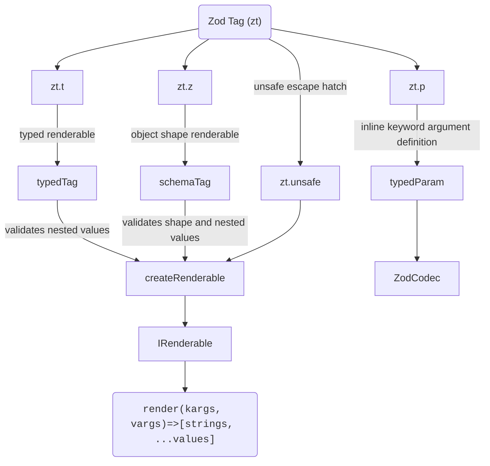

# Zod Tag

This is a experimental library that aims to provide templating composition and type/runtime safe interpolation for tagged template strings by leveraging Zod's validation ecosystem.

At dev/build time this library tries to infer the template types for a better DX.

At runtime this library validates your templates inputs against the zod schemas definitions.

My objective was to implement a api design that came to my mind and experiment with it, dont use this, or do it at your own joy and risk.

## Getting started

### Install

```sh
npm install zod-tag
```

### Usage
```ts
import { z } from 'zod'
import { zt } from 'zod-tag'

const user = zt.z({
    firstName: z.string(),
    lastName: z.string(),
})`
    Hello user, your full name must be: ${e => `${e.firstName} ${e.lastName}`}
`

user.render({ firstName: 'John', lastName: 'Doe' })
```

## The API

Either use the `zt.t`|`zt.template` tag or the schema shape `zt.z`|`zt.zod` tag to declaratively define you templates, those functions returns a `IRenderable` interface.

The `IRenderable` interface provides a `render()` method that will receive:
- Keyword Arguments (Kargs) in the first parameter as `Record<string, unknown> | void` (void if no kargs exists for a given template)
- Variadic Arguments (Vargs) in the second parameter as `unknown[] | void` (void if no vargs exists for a given template)

When possible `unknown` will be infered from nested templates, zod schemas input/output or primitives interpolated in the tagged template call.

## Example usage:

### Static templates

Interpolate your template with primitive values or no interpolation.

```ts
    const greeting = zt.t`Hello`
    // -> IRenderable<void, [], []>

    const rendered = greeting.render();
    // -> [['Hello']]

    const [strings, ...values] = rendered;
    // strings -> ['Hello']
    // values -> []
    
    const greeting2 = zt.t`Hello ${123}!`.render();
    // strings -> ['Hello ', '!]
    // values -> [123]
```


### Variadic arguments (inline non object input schemas)

Interpolate your template with primitive zod schemas, those values will account as required variadic argument.

```ts

// Variadic arguments are set by inline zod schemas
const greeting = zt.t`Hello, ${z.string()}!`

// greeting.render() -> type error and runtime zod validation error

const rendered = greeting.render(
    // no keyword arguments
    void 0,
    // variadic arguments
    ['John']
)
// interpolation [strs, ...vals] -> [['Hello, ', '!'], 'John']
const [strings, ...values] = rendered;

// Some utilities:

zt.debug(rendered)
// unsafe raw -> "Hello, John!"

zt.raw((val, i) => `(${i}=[${value}])`)(rendered)
// custom transform raw -> 'Hello, (0=[John])!'

zt.$n(rendered)
// transformed template -> "Hello, $0!"

```

### Keyword arguments (object shape with zt.z)

Define a shape before you template and interpolate the content with selector functions that manipulates output values from the schema shape.

```ts
const greeting = zt.z({
    first: z.string(),
    last: z.string(),
})`Hello, ${e => `${e.first} ${e.last}`}!`


// greeting.render() -> type error and runtime zod validation error

const rendered = greeting.render({
    first: 'John',
    last: 'Doe'
})
// interpolation [strs, ...vals] -> [['Hello, ', '!'], 'John Doe']
```

### Keyword arguments (inline with zt.p [or other zod shape])

Use `zt.param` or `zt.p` to inline named parameters definitions

```ts
const greeting = zt.t`Hello, ${zt.p('name', z.string())}!`

const rendered = greeting.render({ name: 'John Doe' })
// -> [['Hello, ', '!'], 'John Doe']

```

Or mix `zt.zod` with `zt.param` and variadic arguments:

> Note that variadic arguments inside a conditionally rendered nested template may cause problems, we can mix them but probably shouldn't.

```ts
const greeting = zt.z({
    date: z.date().optional().default(() => new Date())
})`
    The user ${zt.p('user', z.string())} joined today, ${v => v.date.toLocaleDateString()}}!

    Some variadic message: ${z.string()}
`

greeting.render({
    user: 'John Doe',
    date: '01/01/2026', // <- override zod schema w/ .optional()
}, ['Hello new user!']);
// or greetings.render({ user: 'John' }, ['Hello new user!']) given date is optional

```

### Nested templates

Nest your templates and <s>expect</s> hope the merged kargs, vargs type and schema validations to just work.

> Due to complex recursive types used to infer the composition kargs and vargs, max depth recursion might be reached, so evicting deeply nested templates will avoid slow compilation or recursion limits errors.

```ts
const userHeading = zt.z({ first: z.string(), last: z.string() })`
    First name: ${e => e.first}
    Last name: ${e => e.last}
`

const userFooter = zt.z({ role: z.enum(['Front-End', 'Back-End', 'Full-Stack']) })`
    User role: ${e => e.role}
`

const userCard = zt.t`
    Today: ${new Date().toLocaleDateString()}

    ---- Heading ----
    ${userHeading}

    ---- Footer ----
    ${userFooter}
`

userCard.render({
    first: 'John',
    last: 'Doe',
    role: 'Full-Stack',
})

```

### Escape hatch (zt.unsafe)

Sometimes we may need to be unsafe just for the sake of sanity (or insanity)

```ts
const tableName = 'i_promise_this_is_not_user_input';
const greeting = zt.t`SELECT * FROM ${zt.unsafe(tableName)}`
greeting.render(); // -> [['SELECT * FROM i_promise_this_is_not_user_input]]
```


## Main functions



### (zt.template | zt.t)`` - tagged template

Used to declare typed templates without a base shape for keyword argument validation

Returns a typed `IRenderable` interface

### (zt.zod | zt.z)`` - tagged template

Used to declare typed templates with a base shape for keyword argument validation

Returns a typed `IRenderable` interface

### (zt.param | zt.p)(name, ZodType, transformFn)

Used to declare named parameter (keyword argument) inline/embedded into the template

Returns a `ZodCodec` schema

### zt.unsafe(str: string)

Used as a escape hatch for dynamic values that should be treated as safe and thus statically concatenated.

Returns a void typed `IRenderable` interface with a single static string trusted as safe non user input

## Utility functions

### zt.raw

Receives a `mapFn` to map each value, then returns a new function that:

Given a interpolation tuple will return you the raw string, interpolating everything as raw with `String.raw({ raw: strings }, ...values.map(mapFn))`

### zt.debug

> This is actually just zt.raw(identity)

Given a interpolation tuple this will return you the raw string, interpolating everything as raw with `String.raw({ raw: strings }, ...values)`

### zt.$n

Use this to format the interpolation strings with placeholders marked as dolar sign + index.
`$0, $1, ...$n`

### zt.atIndex

> Same as `zt.$n`  with `@` instead of `$`

Use this to format the interpolation strings with placeholders marked as @ sign + index.
`@0, @1, ...@n`

## Gotchas to be aware of (AI gen)

While zod-tag is a fun experiment, its design pushes TypeScript’s type system and runtime validation to their limits. Be aware of these sharp edges before using it in anything serious.

### TypeScript Performance & Inference Limits
- Deeply nested templates can cause the TypeScript compiler to slow down or fail with Type instantiation is excessively deep errors. The recursive utility types (MergeKargs, TupleFlatten, etc.) were not built for complex, real‑world component trees.

- Mixing many keyword and variadic arguments in a single template may result in the inferred render() signature degrading to any or unknown. When in doubt, keep templates small and focused.

### Variadic Argument Ordering
- Variadic arguments (z.string(), z.number()) are consumed in the order they appear during template interpolation. If you nest a template that itself expects variadic arguments, it will shift the position of subsequent variadic arguments in the parent template.

- Rule of thumb: Avoid mixing named (zt.p) and variadic arguments in the same template unless you fully control the nesting and can guarantee the order. Prefer keyword arguments for composable components.

### Schema Shape Validation is Loose by Default
- zt.z({ ... }) creates a schema using z.object(shape).loose(). This means extra properties are allowed in the keyword arguments object without throwing a validation error.

- This design choice enables easier composition of nested templates but may hide typos or unexpected input.

### Raw Utilities Bypass All Safety
- zt.debug, zt.$n, and zt.raw blindly concatenate values into a string. They do not escape content for SQL, HTML, or any other context. These functions exist only for debugging or introspection. Never use their output in production queries, HTML responses, or shell commands.

### expectsObject Edge Cases
- The internal expectsObject helper makes a best‑effort guess at whether a Zod schema expects an object argument. It handles unions, intersections, and pipes, but complex schemas (e.g., deeply nested ZodEffects, custom refinements) may be misidentified.

- If a schema that should receive the full keyword argument object is mistakenly treated as a variadic schema, runtime errors will occur. Test any non‑trivial schemas thoroughly.

### Error Messages Lack Context

- When Zod validation fails, the error object tells you what went wrong but not where in the template it occurred. Debugging a large composed template with multiple inline schemas can become a treasure hunt.

### No Caching or Pre‑compilation
- Every call to .render() re‑evaluates the entire interpolation logic, including re‑decoding all Zod schemas and re‑executing selector functions. This is fine for occasional use but not suitable for high‑throughput scenarios (e.g., server‑side rendering on every request).

### The API is Not Frozen
- This is an experimental library. Method names, type signatures, and internal behavior may change without notice. Do not depend on it for production systems unless you vendor the code and pin the exact version.